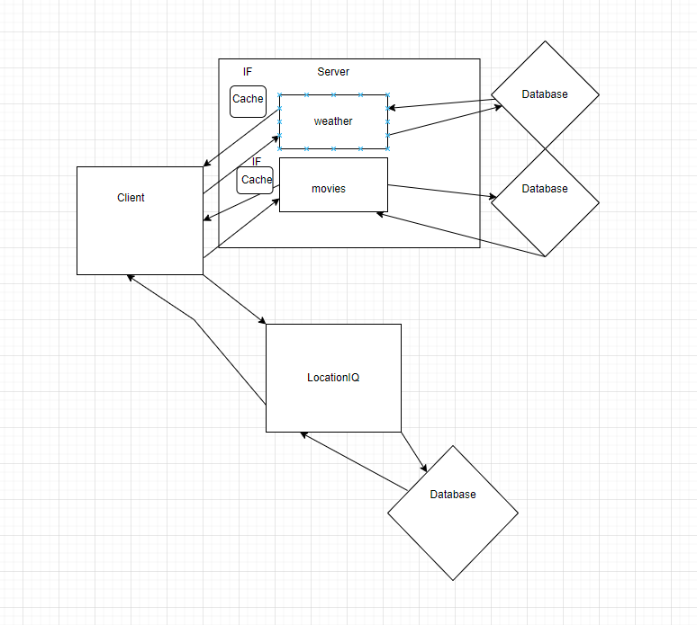

# city-explorer-api

**Author**: J.Matt Miguel
**Version**: 1.0.0 

## Overview

## Getting Started

### Lab7 Wire Frame7

### Lab 8 WireFrame

### 

## Architecture
<!-- Provide a detailed description of the application design. What technologies (languages, libraries, etc) you're using, and any other relevant design information. -->

## Change Log
<!-- Use this area to document the iterative changes made to your application as each feature is successfully implemented. Use time stamps. Here's an example:

01-01-2001 4:59pm - Application now has a fully-functional express server, with a GET route for the location resource. -->

## time estimate
Name of feature: creating class forecast
Estimate of time needed to complete: 30 minutes

Actual time needed to complete: 2 hours

Name of feature: .find method to search json file
Estimate of time needed to complete: 3 hours

Actual time needed to complete: 12 hours

Name of feature: pulling lat and long from weather API
Estimate of time needed to complete: 3hours

Actual time needed to complete: 1.25 hours

Name of feature: adding movie data from API
Estimate of time needed to complete: 3hours

Actual time needed to complete: 6 hours/ with breaks

## Credit and Collaborations

- Lab6 WireFrame exercise with Rey Mercado
- Lab7 WireFrame with Daniel Jackson
- Lab8 WireFrame with Chris Harden
